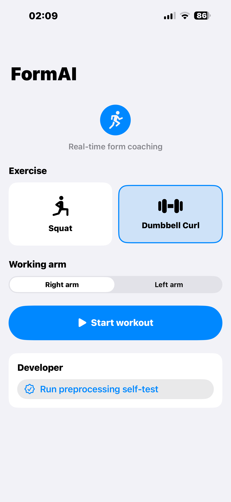
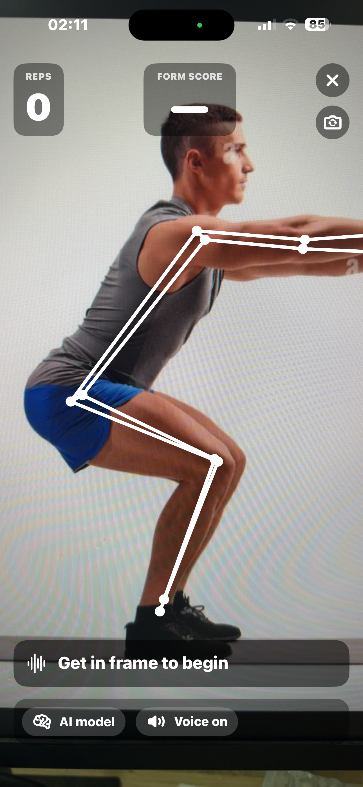

# FormAI

### AI-Powered Exercise Form Coach for iPhone

[](https://swift.org)
[](https://developer.apple.com/machine-learning/core-ml/)
[](https://developer.apple.com/machine-learning/core-ml/)
[](https://mediapipe.dev)

**Real-time rep counting and early form correction using on-device pose tracking and Core ML**

[Overview](#overview) · [Features](#features) · [How-It-Works](#how-it-works) · [Tech-Stack](#tech-stack) · [Quick-Start](#quick-start) · [Project-Structure](#project-structure)

---

## Overview

FormAI is an iPhone workout coaching app that analyzes body movement from the camera feed and scores exercise form on-device.

Current exercise support:

- **Bodyweight squat**
- **Single-arm dumbbell curl**

Current goals of the project:

- fast pose detection on-device
- reliable rep counting
- live coaching that catches mistakes during the rep
- form scoring that matches the training pipeline
- spoken cues for correction

---

## Features

### Workout Experience

- **On-device pose tracking** with MediaPipe Pose
- **Rep counting** for squats and curls
- **Conservative live coaching** using recent-frame rule checks during the rep
- **Final rep scoring** using Core ML with a rule-based fallback
- **Voice coaching** with short spoken correction cues
- **Skeleton overlay** and framing guidance in the live camera view
- **Local progress tracking** with last workout, streak, and best score summaries
- **Supported now / planned next** exercise roadmap on the home screen
- **Safety guidance** for framing and when to stop a set

### ML Pipeline

- **Real-data curl pipeline** rebuilt from upstream training and test CSVs
- **Core ML export** for direct iOS bundling as `.mlpackage`
- **Shared preprocessing contract** between Python training and Swift inference
- **Model cards** documenting feature order, labels, and tensor shape

### Engineering Guardrails

- **Golden preprocessing checks** for contract verification
- **Unit tests** for adapter behavior and squat feature extraction
- **Fallback scoring** when the model is unavailable

---

## Demo Screens

### Home - Squat Selected

Exercise picker with squat selected and the main one-tap workout entry point.


### Home - Dumbbell Curl Selected

Curl setup flow with the working-arm picker visible before the workout starts.



### Live Workout View

Camera-first workout screen with pose overlay, rep counter, final score tile, and live coaching controls.



### Progress Summary

Local progress card showing workout count, streak, and best-score summary on the updated home screen.


### Supported / Planned / Safety

Roadmap and safety guidance section from the lower half of the home screen.


---

## How It Works

```text
Camera Feed -> MediaPipe Pose -> Rep Counter -> Live Rule Check -> Final Rep Score -> Voice Cue + History
```

### Runtime Pipeline

1. **Capture**  
   The iPhone camera streams frames into the app.

2. **Detect**  
   MediaPipe Pose extracts 33 landmarks from each frame.

3. **Track**  
   The rep counter watches joint angles and groups frames into reps.

4. **Coach Live**  
   While a rep is in progress, recent-frame rule checks surface early warnings like knee cave, torso swing, or shallow range.

5. **Analyze Final Rep**  
   Completed reps are preprocessed into a fixed `[32, F]` tensor.

6. **Score**  
   Core ML predicts form quality, or the rule engine provides fallback feedback.

7. **Coach + Save**  
   The app updates the final rep score, speaks a cue, and stores a local workout summary.

---

## Exercise Support

| Exercise | Labels | Runtime |
| --- | --- | --- |
| Squat | `good`, `knee_valgus`, `insufficient_depth`, `back_rounding` | Core ML + rules |
| Dumbbell Curl | `good`, `swing` | Core ML + rules |

---

## Supported Now / Planned Next

Supported now:

- **Squat**
- **Dumbbell Curl**

Planned next:

- **Lunge**
- **Guided mode**
- **Expanded exercise library**

---

## Tech Stack

| Layer | Technology | Purpose |
| --- | --- | --- |
| iOS App | SwiftUI, AVFoundation | Camera, UI, live workout flow |
| Pose Detection | MediaPipe Pose | 33-landmark body tracking |
| ML Inference | Core ML | On-device form scoring |
| Training | PyTorch, NumPy, pandas | Model training and preprocessing |
| Export | coremltools | `.mlpackage` generation |
| Fallback Logic | Swift rules | Safe scoring when the model is missing |

---

## Quick Start

### Python Environment

```bash
python3.11 -m venv formai_env
. formai_env/bin/activate
pip install --no-cache-dir -r requirements.txt
```

Optional squat adapter dependency:

```bash
pip install -r requirements-posture-optional.txt
```

### Rebuild Data

```bash
formai_env/bin/python data_adapter.py
```

### Train and Export

Train both exercises:

```bash
formai_env/bin/python formai_pipeline.py --exercise all
```

Train curl only:

```bash
formai_env/bin/python formai_pipeline.py --exercise curl
```

### Verify Python Side

```bash
formai_env/bin/python -m unittest discover -v
formai_env/bin/pip check
```

### iOS Project

Open:

```bash
open FormAI.xcworkspace
```

---

## Project Structure

```text
form-ai-1/
├── FormAI/                         # iOS app
│   ├── Camera/                     # Camera session and preview
│   ├── Feedback/                   # Voice coaching
│   ├── Inference/                  # Core ML loading and scoring
│   ├── Models/                     # Exercise config and pose types
│   ├── Pose/                       # MediaPipe provider
│   ├── Resources/                  # Bundled .mlpackage files and model cards
│   ├── ViewModels/                 # Workout orchestration
│   ├── Views/                      # SwiftUI screens and overlays
│   └── Vision/                     # Preprocessing, geometry, rep counting
├── formai_data/                    # Real rep clips and manifest
├── models/                         # Exported Core ML packages and model cards
├── third_party/                    # Pruned upstream references
├── data_adapter.py                 # Real-data clip builder
├── formai_pipeline.py              # Train + export pipeline
├── exercise_correction_adapter.py  # Python adapter over upstream assets
└── test_exercise_correction_adapter.py
```

---

## Current Status

- Squat path is integrated and working.
- Curl path has been rebuilt with a real-data-only pipeline.
- Curl model is now exported as a Core ML package and bundled into the app.
- Home screen now includes progress, roadmap, and safety content.
- Workout screen now distinguishes **live coaching** from the **final rep score**.

---

## What Needs Improvement

- **More live-rule tuning** for squat and curl edge cases
- **More validation clips** for curl test accuracy
- **Embedded screenshot assets** inside the repo for richer README media
- **More exercise coverage**

---

## Verification Notes

- Python tests pass with `formai_env`.
- The Swift contract changes compile past preprocessing/model generation.
- Full iOS linking may still require local MediaPipe framework setup depending on the machine.

---

## Vision

FormAI should feel like a fast, private, on-device coach:

- see the pose immediately
- catch bad form early
- correct the rep before it finishes
- keep the experience simple enough to use during an actual workout
