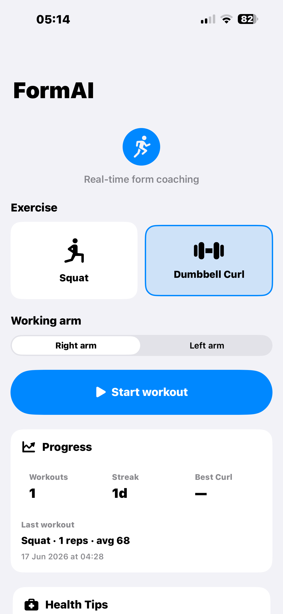
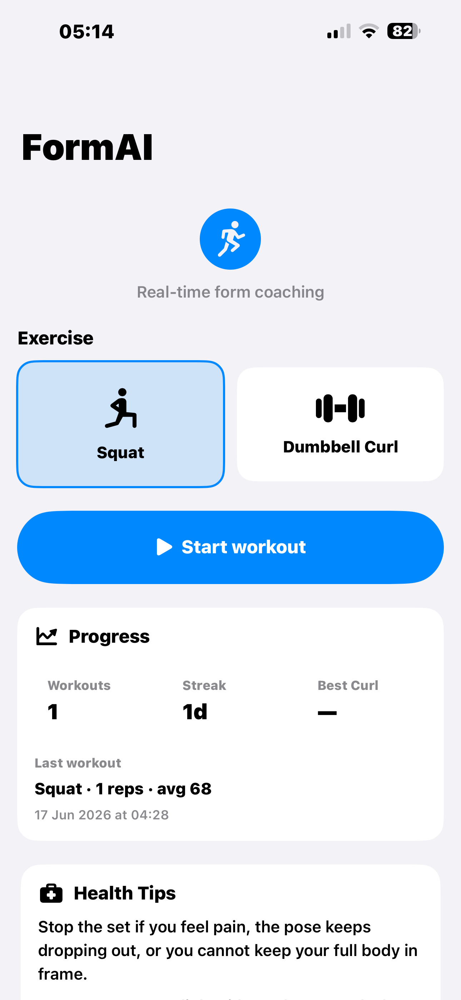

# FormAI

### AI-powered exercise form coach for iPhone

[](https://swift.org)
[](https://developer.apple.com/machine-learning/core-ml/)
[](https://developer.apple.com/machine-learning/core-ml/)
[](https://mediapipe.dev)

**Compact on-device form coach with just the core MVP flow: pick an exercise, start the camera workout, and get live correction.**

[Overview](#overview) · [Features](#features) · [Demo](#demo) · [How it works](#how-it-works) · [Tech Stack](#tech-stack) · [Quick Start](#quick-start) · [Structure](#project-structure)

---

## Overview

FormAI is an iPhone workout coach that uses on-device pose tracking and Core ML to count reps, score exercise form, and give instant coaching.

Supported exercises:

- **Bodyweight squat**
- **Single-arm dumbbell curl**

Built for a lightweight MVP with a focused live coaching flow and a Python-to-Core ML training pipeline.

---

## Features

- **Live pose tracking** using MediaPipe Pose
- **Rep counting** for squat and curl
- **Early form coaching** via live rule checks
- **Final form scoring** with Core ML
- **Voice cues** for correction
- **Skeleton overlay** and framing guidance
- **Python preprocessing + export pipeline**
- **Safe fallback scoring** when the model is unavailable

---

## Demo

<table>
  <tr>
    <td></td>
    <td></td>
  </tr>
  <tr>
    <td align="center">Home — Squat</td>
    <td align="center">Home — Curl</td>
  </tr>
</table>

---

## How it works

1. **Capture** — camera frames stream into the app.
2. **Detect** — MediaPipe Pose extracts 33 body landmarks.
3. **Track** — the rep counter identifies completed reps.
4. **Coach** — live rule checks warn on form issues.
5. **Score** — Core ML predicts form quality.
6. **Speak** — instant voice guidance is delivered.
7. **Fallback** — if the model is unavailable, rule-based scoring still works.

---

## Supported Exercises

| Exercise | Runtime | Notes |
| --- | --- | --- |
| Squat | Core ML + rules | bodyweight squat scoring + rep counting |
| Dumbbell Curl | Core ML + rules | curl form and swing detection |

---

## Tech Stack

| Layer | Technology | Purpose |
| --- | --- | --- |
| iOS | SwiftUI, AVFoundation | camera, UI, workout flow |
| Pose | MediaPipe Pose | on-device landmark extraction |
| Inference | Core ML | real-time form scoring |
| Training | Python, NumPy, pandas | preprocessing and model pipeline |
| Export | coremltools | `.mlpackage` generation |
| Rules | Swift | fallback coaching and validation |

---

## Quick Start

### Python setup

```bash
python3.11 -m venv formai_env
. formai_env/bin/activate
pip install --no-cache-dir -r requirements.txt
```

Optional posture adapter:

```bash
pip install -r requirements-posture-optional.txt
```

### Rebuild data

```bash
formai_env/bin/python data_adapter.py
```

### Train and export

```bash
formai_env/bin/python formai_pipeline.py --exercise all
```

### Run tests

```bash
formai_env/bin/python -m unittest discover -v
formai_env/bin/pip check
```

### Open the app

```bash
open FormAI.xcworkspace
```

---

## Project Structure

```text
form-ai-1/
├── FormAI/                         # iOS app source
│   ├── Camera/                     # camera capture and preview
│   ├── Feedback/                   # voice coaching
│   ├── Inference/                  # Core ML scoring and rule-based fallback
│   ├── Models/                     # exercise config, pose types, history store
│   ├── Pose/                       # MediaPipe provider
│   ├── Resources/                  # bundled .mlpackage models and model cards
│   ├── SelfTest/                   # preprocessing golden test
│   ├── ViewModels/                 # workout orchestration
│   ├── Views/                      # SwiftUI screens
│   └── Vision/                     # preprocessing, rep counting, geometry
├── docs/                           # README assets
├── formai_data/                    # training clips and manifest
├── models/                         # exported Core ML packages
├── data_adapter.py                 # real-data clip builder
├── formai_pipeline.py              # train + export pipeline
├── exercise_correction_adapter.py  # upstream adapter wrapper
└── test_exercise_correction_adapter.py
```

---

## Status

- On-device Core ML scoring is integrated into the app.
- Live coaching and rep counting are implemented for squat and dumbbell curl.
- Python pipeline supports preprocessing and model export.

## Roadmap

- Add more exercise types: lunges, push-ups, overhead press
- Improve model accuracy and edge-case coaching
- Add guided workout mode
- Add lightweight demo video or GIF
